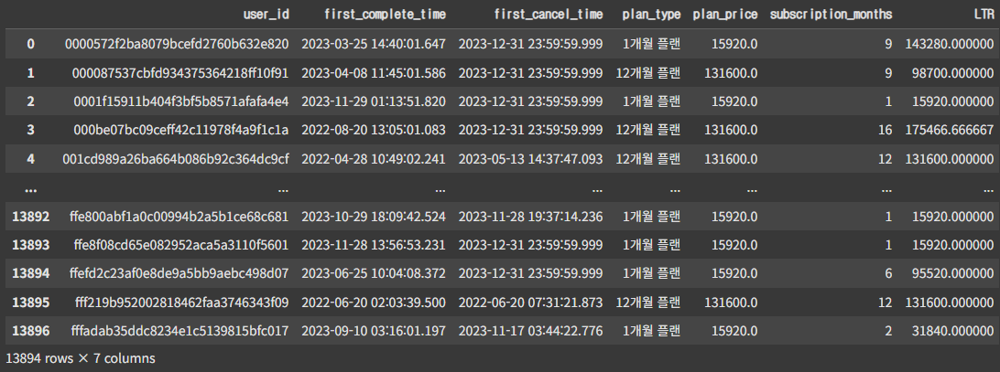

# 교육 구독 서비스 분석 (중급 1 프로젝트)

## 프로젝트 개요
- **기간**: 2025.07.07 ~ 2025.07.29
- **프로젝트명**: 교육 구독 서비스 분석
- **주제**: 무료 체험이 구독 전환률과 LTV에 미치는 영향 분석
- **역할**: 구독 전환·수익성 분석(파트 1-2) 전담  
  팀 내 분석 진행 구조 설계 및 데이터 기반 인사이트 도출
- **사용 기술**: Python (Pandas, Numpy, Scipy, Matplotlib), Google Colab, VS Code

---

## 문제 정의
> **핵심 질문**: 7일 무료 체험이 전환률과 수익성에 실제 기여하는가?  
> **목표**: 무료 체험군과 비체험군의 전환률 및 LTV 비교, 전환 타이밍 기반 리마인드 전략 제안

---

## 분석 과정
1. **데이터 전처리**
   - 이상치 제거
   - 결제·취소 로그 누락 보정
   - 구독기간 계산 로직 설계 (`user_df` 생성)    
     
2. **전환률 분석**
   - 로지스틱 회귀, z-test를 통한 무료 체험 효과 검증  
     
3. **수익성 분석**
   - LTR/LTV 계산: 플랜 단가 × 구독 개월 수 – CPA
4. **전환 시점 분석**
   - 무료 체험자의 전환 집중 구간 파악 (2~4일차, 4~6일차, 11~12일차)

---

## 주요 결과
1. **전환률**: 무료 체험군 약 23% (비체험군 약 7% 대비 3배 높음)    
     
2. **수익성**: 무료 체험군 LTR > 비체험군 LTR    
   → CPA 반영 시 LTV는 유사하거나 소폭 낮음  
     
3. **전환 타이밍**: 체험 기간 2 ~ 4일차 및 종료 후 4 ~ 6일차에서 추가 상승  
     
     

---

## 인사이트 & 개선안  
- 무료 체험은 **전환률 증대에는 효과적**이나, LTV 개선 효과는 제한적  
- **무료 체험 기간 조정**: 7일 → 4일 단축 가능성 제시    
      
- **리마인드 전략**  
  - 체험 종료 후 4 ~ 6일차 카카오 알림톡 발송
- **콘텐츠 동반 전략**
  - 리마인드 메시지에 같은 팀원의 분석 인사이트인 신규 콘텐츠 노출로 관심 지속 유도
      

---

## 본인 기여

1. **팀 내 분석 구조 설계 및 협업 환경 세팅**
   - 프로젝트 초반 팀 전체 분석 구조 설계 (1-1, 1-2, 1-3 파트 구분)
   - 각 파트별 분석 인사이트를 공유하는 **구글 시트 제작** 및 관리
   - 팀 간 데이터 흐름 연결 아이디어 제안 (전환·이탈·수익성 파트간 연계 스토리라인 구성)

2. **LTR/LTV 계산 로직 설계**
   - 결제·취소 로그 기반 구독기간 산정    
   - 레슨당 단가 계산 후 매출 산출  
       
         

3. **무료 체험군 vs 비체험군 비교 분석**
   - 전환률·수익성 비교 및 z-test 등 통계 검증 수행

4. **마케팅 전략 제안**
   - 전환 시점 기반 리마인드 발송 타이밍 도출
   - 신규 콘텐츠 노출을 포함한 CRM 전략 제안

5. **문서화**
   - 발표자료 및 보고서 1-2 파트 작성, 데이터 시각화
